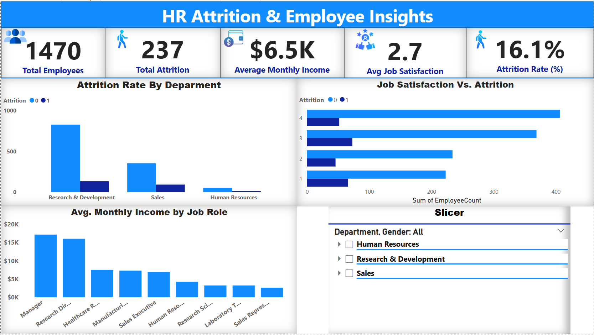

## HR_Attrition_Employee_Insights

## 📊 Overview
This project analyzes HR data to uncover trends related to employee attrition, job satisfaction, and compensation. The goal is to help HR teams identify high-risk groups and improve retention strategies.
Also the project explores employee attrition trends and workforce insights across departments using data-driven techniques 

## 🛠 Tools Used
- Excel: Data cleaning and basic analysis
- SQL: Advanced querying and insights
- Power BI: Interactive dashboards

## 💡 Key Insights
- Highest attrition rates are found in the Research & development department.
- Employees with low job satisfaction and long commutes are more likely to leave.
- Monthly income is not the strongest predictor of attrition—job satisfaction is.

## 📁 Project Structure
- `data/`: Raw and cleaned data
- `sql/`: Analysis queries
- `excel/`: Pivot tables and charts
- `powerbi/`: Power BI dashboard
- `screenshots/`: Dashboard preview 

## 📷 Dashboard Preview

## 🔗 Dataset Source
[IBM HR Analytics Attrition Dataset](https://www.kaggle.com/datasets/pavansubhasht/ibm-hr-analytics-attrition-dataset)
